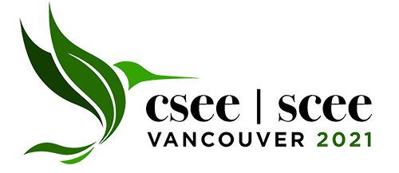

## [R Package Development for Research: an Introduction](https://vlucet.github.io/R_pkg_dev_for_research_CSEE_2021/)

[Link to the slides.](https://vlucet.github.io/R_pkg_dev_for_research_CSEE_2021/)

[Link to the example package `carbon` for this workshop.](https://github.com/VLucet/carbon)

### CSEE 2021 Workshop

Software tools such as R packages are essential to research efforts in ecology and evolution. Coding and research software engineering skills are becoming increasingly common in graduate training, and are now in higher demand for academic positions. Still, researchers are seldom taught how to write code suitable to be packaged into research software, and fewer can design, develop and maintain software packages. In addition, researchers are often not aware of  the ways in which package development can improve and systematize their research workflow. In this workshop, you will learn how to use industry standard tools for R package development. You will also be given tips to turn single-project research scripts into generalizable code. You will learn the best practices for designing an R package, from writing functions to making use of object oriented class systems. You will learn the typical workflow for package development, including basic debugging methods and how to iteratively create a friendly user interface. Finally, you will get an overview of the best practices in package maintenance and distribution, from unit testing to continuous integration to submissions to repositories like CRAN or ROpenSci. Throughout the workshop, the best available resources package development will be shared. 

### Objectives
1. Demonstrate how developing R packages can improve your research
2. Explain the benefits and explore the trade-offs of R package development in a research context
3. Provide a step by step recipe for adapting research code and scripts into a software package
4. Present the best practices in package design, development and maintenance

### Prerequisites
Although the workshop is designed to meet participants at any skill level, it is recommended to be well acquainted with using R, Rstudio and version control software (such as git and github). Participants are welcome to contact me at valentin.lucet@mail.mcgill.ca if they are worried they do not have an appropriate level and wish to discuss it.

### About Valentin
Valentin Lucet is a landscape ecologist and research software developer, specializing in ecological modeling and open source software skills. He holds an M.Sc. in Biology from McGill University, and provides expertise and training in research software to academia and government. His project experience includes landscape connectivity conservation and participatory methods.
