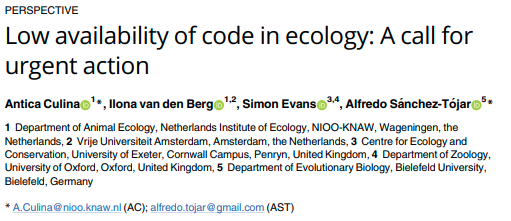
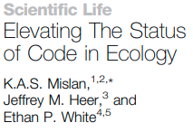
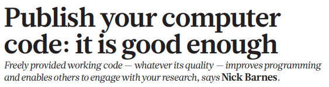
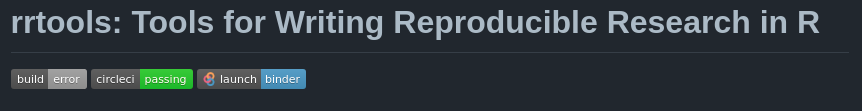
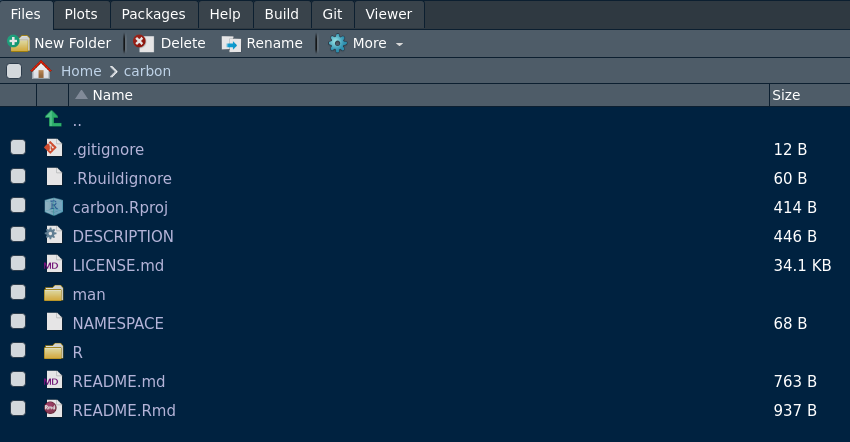

<!-- -->

```{r setup, include=FALSE}
options(htmltools.dir.version = FALSE)
knitr::opts_chunk$set(
  fig.width=9, fig.height=3.5, fig.retina=3,
  out.width = "100%",
  cache = FALSE,
  echo = TRUE,
  message = FALSE, 
  warning = FALSE,
  fig.show = TRUE,
  hiline = TRUE
)
```

```{r xaringan-themer, include=FALSE, warning=FALSE}
library(xaringanthemer)
style_mono_accent(
  base_color = "#1c5253",
  title_slide_text_color = "#1c5253",
  header_font_google = google_font("Josefin Sans"),
  text_font_google   = google_font("Montserrat", "300", "300i"),
  code_font_google   = google_font("Fira Mono"),
  title_slide_background_image = "images/title_slide_background_edited.png",
  text_font_size = "1.1em"
)
```

```{r xaringanExtra-allextras, include=FALSE, warning=FALSE, echo=FALSE}
xaringanExtra::use_tile_view()
xaringanExtra::use_share_again()
xaringanExtra::use_broadcast()
xaringanExtra::use_scribble()
xaringanExtra::use_animate_css()
xaringanExtra::use_panelset()
xaringanExtra::use_clipboard()
xaringanExtra::use_fit_screen()
xaringanExtra::use_webcam()
# xaringanExtra::use_animate_all("fade")
```

## About me


 * __RSE__ at __Concordia University__ (lab of Dr. Eric Pedersen)
 
 * __Data Scientist__ at __Environment Canada (ECCC)__ (Landscape Science Unit)
 
 * Have been coding in R for ~ 7-8 years
 
 * Maintaining 4 packages (2 on CRAN), contributed to 3 other
 
 * B.Sc. (Hons) & M.Sc. McGill University (Biology)
 
 * Website: [___vlucet.github.io___](https://vlucet.github.io/)

---
name: plan 1
## Workshop: Part 1 (now -> 10:30)

<!-- 9:30 - 9:35 : let people trickle in -->
<!-- 9:35 - 9:40 : personal introduction -->

1. __Research software in Eco-Evo__ (__~ 20 minutes__) <!-- 9:40 - 10:00 -->
  * What is research software?
  * To Package or not to Package: what are the alternatives?
  * General vs workflow oriented packaging.
  
2. __From "spaghetti code" to "packaged" code__ (__~ 20 minutes__) <!-- 10:00 - 10:20 -->
  * Tips and tricks to modularize your research code.
  * How to write clean code.
  * Object-oriented designs and functional programming.
  * (__Break: 10 minutes__) <!-- 10:20 - 10:30 -->

---
name: plan 2
## Workshop: Parts 2 & 3 (10:30 -> 12:30)

3. __A package step by step with `usethis` and `devtools`__ (__~ 50 minutes__) <!-- 10:30 - 11:20 -->
  * Let's create an example package step by step.
  * (__Break: 10 minutes__) <!-- 11:20 - 11:30 -->
  
4. __Package testing, maintenance and distribution: best practices__ (__~ 50 minutes__) <!-- 11:30 - 12:20 -->
  * How to test, maintain, and distribute your package.

__Q & A__: If time allows, __~ 10 minutes__ (or on the conference app at any time) 

---
name: prereqs

## Before we get started...

For today, it is recommended that you are already pretty well acquainted with __R__ and __Rstudio__. But, if at least you...
  * Have written a few __functions with multiple arguments__ in R 
  * Know about "__project oriented workflow__" (for instance you use RStudio projects) 
  
...then you have the bare minimum we need for today!

Knowledge of Git/Github is also welcome as I won't have the time to explain version control software.

```r
# Run this in R before we start. 
pkgs <- c("devtools", "roxygen2", "usethis")
install.packages(pkgs)
```

_Note: the first part of the workshop is relevant to users of any level._

---
name: refs

## On not reinventing the wheel...

There exists a __plethora of great resources on R package making__, resources from which I have learned myself. 

This workshop has been devised by attempting to __synthesize many freely available resources__ put together by a whole bunch of excellent people. 

_A full list of resources is included at the end of this workshop._

.center[
]

---
class: inverse center middle

## Research software in Eco-Evo 

---
## What is research software?

__Research software__ can be defined as any computer-based application that directly or indirectly supports users in a research task<sup>1</sup>.

For example: 
- Any software packages used to conduct research, but also
- Any script that employ these packages, and
- Any code or program used to manage and process data

Can also include:
- Proprietary software (Matlab, ArcGIS, etc...)
- Any program that runs on data collection hardware
 - Camera traps
 - Temperature sensors
 - etc.

.footnote[[1] [IGI Global](https://www.igi-global.com/dictionary/knowledge-visualization-for-research-design/69111)]

---
## Who writes research software?

__Research software__ is written by __Research software engineers__

_A Research Software Engineer (RSE) combines professional software engineering expertise with an intimate understanding of research._<sup>1</sup>

A wider definition would also include, independently of whether they have received formal training in software engineering:
- Any __HQP__ (Highly Trained Personnel) who writes code in a research context (grad student, post-doc, etc.)
- Research assistant, lab managers, undergraduate students involved in producing code

The RSE hat is often shared and worn by different people in a lab, and increasingly researchers are required to acquire RSE skills.

.footnote[[1] [RSE Society](https://society-rse.org/about/)]

---
## RSE & code "openness"

<a href="https://journals.plos.org/plosbiology/article?id=10.1371/journal.pbio.3000763">  </a>

<a href="https://www.cell.com/trends/ecology-evolution/fulltext/S0169-5347(15)00290-6?_returnURL=https%3A%2F%2Flinkinghub.elsevier.com%2Fretrieve%2Fpii%2FS0169534715002906%3Fshowall%3Dtrue">  </a>

<a href="https://www.nature.com/articles/467753a">   </a>

__Software & Code literacy__, i.e. the ability to write, test and deliver reproducible code, is an essential skill to solve the reproducibility crisis in Eco-Evo.

---
## Open source software


_Open source software is software with source code that anyone can inspect, modify, and enhance._<sup>1</sup>

Like most research, research in eco-evo could not take place without OSS (think of the R language and the all the add-on packages).

Good RSE is therefore guided by OSS principles, paradigms, and tools, the width of it being too large to cover today.

.footnote[[1] [opensource.com](https://opensource.com/resources/what-open-source)]

---
## FAIR Software<sup>1</sup>

1. __Findable__
  - rich metadata + unique, persistent, identifier.

2. __Accessible__
  - metadata is both  machine AND human readable.
  - deposited in trusted community approved repository.

3. __Interoperable__
  - uses community accepted standards and platforms.

4. __Reusable__
  - clear licence and documentation.
  
.footnote[[1] [library carpentry](https://librarycarpentry.org/Top-10-FAIR/2018/12/01/research-software/)]

---
## Is software a scientific contribution?

Research software is often __not recognized__ as a scientific contribution in its own right. Yet, research code:
- Represents a very significant part of a researcher's time.
- Advances our knowledge of the "how", just like research protocols.
- Should be easily citable to improve methods tractability.

Recognizing RS as a scientific contribution is not a vanity for RS developers: __code should under better scrutiny, and should be submitted to peer review__.

Who is reviewing code?
- [ROpenSci software peer review](https://ropensci.org/).
- [JOSS](https://joss.theoj.org/) and other software journals.

---
class: inverse center middle

# To Package or not to Package?

---
## Should your package exists?

A few questions to ask yourself<sup>1</sup> :

1. Will this piece of software really be useful to someone else than you? 

2. Is your idea really new, or is there already a package out there performing the exact same task?

3. If there is one, would your implementation bring something to the market, e.g. an user-friendlier implementation? 

4. If there is already a similar package, should you work on your own or collaborate with the author(s) of the original package?

5. As a grad student or PI, is the time spent in development worth the effort?

.footnote[[1] [M. Simon's blog post](https://masalmon.eu/2017/12/11/goodrpackages/)]

---
## Private packages

_"Packaging doesn't have to be about sharing the code, it can just be to save yourself time."_<sup>1</sup>

Packages do not have to be written for someone else than yourself. Consider writing a personal package. For example, consider packaging Scripts that:
- You have re-used more than once
- You have shared with students and/or collaborators
- Produces this a specific analysis or figure that is often re-used within your lab

Consider starting a __lab package project__ where students are encourage to contribute functions and document them, therefore ensuring that the coding knowledge accumulated through often tedious trial and error is curated and can serve you and your students in the future.

.footnote[[1] [H. Parker's blog post](https://hilaryparker.com/2014/04/29/writing-an-r-package-from-scratch/)]

---
## What other forms does research software take?

A __Package__ is only one way to distribute research code. I want to mention __research compendiums__ as the best alternative to writing and releasing a package.

_The goal of a research compendium is to provide a standard and easily recognizable way for organizing the digital materials of a project to enable others to inspect, reproduce, and extend the research._<sup>1</sup>

<a href="https://github.com/benmarwick/rrtools">   </a>

Note: sometimes compendiums are actually R packages bundled in a specific way.

.footnote[[1] [R for Reproducible Research course](https://annakrystalli.me/rrresearch/10_compendium.html)]

<!--
## To Package or not to Package? (cont'd)
<!-- Discuss the effort at different stages of research. 
-->

---
## What should a package contain?

Two principles<sup>1</sup> :

1. Make your package compatible with the workflow of your users. 

2. Do not get too ambitious. 

I would add, consider principles of the [Unix philosophy](https://en.wikipedia.org/wiki/Unix_philosophy):

1. Small building blocks (small functions for example)

2. "Do One Thing and Do It Well"

.footnote[[1] [M. Simon's blog post](https://masalmon.eu/2017/12/11/goodrpackages/)]

---
## How to name your package

__Naming things is hard__. but here are a few advice<sup>1</sup> :

1. Use __lower cases__, this way your user doesn’t need to remember where the capital letters are and  full capital letter name looks like screaming.

2. Use the R package `available`, to check whether the name is valid (no special characters, etc.), whether CRAN already hosts a package with the same name and searches the web for unintended meanings of the name.

3. If your package revolves around a __central function__ or interfaces with __another program__, consider using these as the name.

.footnote[[1] [M. Simon's blog post](https://masalmon.eu/2017/12/11/goodrpackages/)]

---
## Research packages fall into 3 broad categories

From the widest to the narrowest user base, on a continuum from generality to specificity:

1. To provide a __general research tool__ in R.

2. To implement a __method__.

2. To make a certain __workflow__ reproducible and adaptable.

The first 2 are examples of __tooling__ packages: general purpose, no object structure (or very light). One function does one thing.

The last is an example of a __workflow__ package: can have a strong object structure (but beware!). In the back, may be built with simpler "tooling" elements.

<!--
## "tooling" packages
<!-- Characteristics: general, no object structure (or very light). One function does one thing. Lab package, personal package 
-->
 
<!--
## "workflow" packages 
<!-- Makes a specific research workflow available, can have a strong object structure (but beware!). In the back, may be built with simpler "tooling" elements 
-->

<!--
## A research package decision chart
<!-- Make a decision chart that sums up all we talked about and if we have time ask if there are any questions 
-->

---
class: inverse center middle

## From "spaghetti code" to "packaged" code 

---
## Messy code
<!-- Messy code is not necessarily bad code, but one could argue that it is "unfinished code", no one took the time to clean it up. Why? talk about how this part of the research process might not be valorized as much. -->

Messy code is ubiquitous in research, BUT:

.center[
__Messy code ≠ Bad code__
]

In fact, this is closer to the truth: 

.center[
__Messy code = Unfinished code__
]

Cleaning up research code should be considered an integral part of the research process. It is often the first step in any packaging endeavor.

Two aspects of code "cleanliness":

1. The way __it looks__ (spaces, number of lines, etc.)

2. The way __it reads__ (measured in "WTFs per minute"<sup>1</sup> as you read it)

.footnote[[1] [Uncle Bob's Clean Code Lectures](https://www.youtube.com/watch?v=7EmboKQH8lM)]

---
## How to write clean (R) code

<a href="https://imgs.xkcd.com/comics/good_code.png">   </a>

- Use an __IDE__ (RStudio, VSCode, etc.).

- Learn to follow a style guide, for example [the tidyverse](https://style.tidyverse.org/) or [Google's](https://google.github.io/styleguide/Rguide.html).

- Name things well (re: naming is hard). Don't be afraid to use long, informative function and variable names.

- Write __functional__ code, i.e. code made with functions, each function accomplishing one thing (recall the Unix's Do One Thing Well).

---
## How to write clean (R) code

- Write useful comments: do not comment everything in the code, just the parts that actually need explaining.

- Use tools to identify and fix style issues in code. The packages [`lintr`](https://github.com/jimhester/lintr) and [`goodpractice`](https://github.com/MangoTheCat/goodpractice) are a good way to start.

- Engage in code review: the best way to know if your code is clean to have someone else take a look at it. Consider setting up code review sessions between students and/or collaborators. GitHub makes it easy to get started with reviewing code.

---
## Packaging your messy code

A simple (recursive) recipe for packaging research scripts into a __proto-package__: 

1. Identify __modules__. Modules are pieces of codes that stands on their own and that either:
 - Achieve a specific task. 
 - Represent a discrete step in the workflow.
 
2. Establish the __expected behavior__ of each module (e.g. write tests)

2. "Refactor" modules into __functions__

3. __Rewrite__ your script to employ these functions. 

4. Repeat the process __within__ each function.

5. Consider your code _modularized_ when each function Only Does One Thing (yes, this is subjective).

---
## Object-Oriented Programming

Once you have a working proto-package, you can start thinking about whether your package is suited to an object-oriented design.

There a several key principles in object oriented programming<sup>1</sup> : 

1. The first are the ideas of a __class__ and an __object__. 
 - An object is a way to represent data with some constraints (for example, a `data.frame` object organises vectors into columns). 
 - A class is a blueprint for an object: it describes the parts of an object, how to make an object, and what the object is able to do.

2. Functions that operates onto an object of a given class is called a __method__ of this class.

If your package requires you to organize and manipulate information with specific constraints, it might be rekevant to use OOP design.

.footnote[[1] [Mastering Software Development in R](https://bookdown.org/rdpeng/RProgDA/object-oriented-programming.html)]

---
## OOP in R

The 3 most popular types of OOP frameworks in R<sup>1</sup> :

1. __S3__ is R’s first OOP system, and is a rather informal implementation, relying on relies on conventions rather than "ironclad guarantees". __Easiest to start with, low cost way to solve many simple problems__.

2. __S4__ is a formal and rigorous rewrite of S3, with more guarantees and greater encapsulation.

3. __R6__ is provided by a package and implements __mutable__ S4 objects.

Which one to choose? Many trade-offs exists. 

In a nutshell: __choose S3 for simplicity, S4 for rigor and R6 if you need mutability__.

.footnote[[1] [Advanced R Book](https://adv-r.hadley.nz/oo.html)]

---
class: inverse center middle

## A package step by step with {usethis} and {devtools}

---
## The 4 pillars of R package dev
<!-- Describe the 4 packages -->

1. `devtools` 
  - The R developper swiss-army knife: install packages from github, check and test packages, build documentation, etc...

2. `usethis` 
  - Automates many steps in the development workflow

3. `roxygen2` 
  - The backend of devtools's documentation routine. Generates html documentation from a specific markdowm format.

4. `testthat` 
  - The backend of devtools's testing routine. Functions to help with writing test and finding errors in the code.

---
## Let's make a package: `carbon`

We are going to code a small package called `carbon` which will retrieve the data from the Mauna Loa observatory on carbon concentration in the atmosphere.

We will package 2 functions: (1) to retrieve the data, and (2) tells you the carbon concentration around a given date.

Therefore, the process we are going to go through touches on 2 aspects of RSE:

1. Obtaining and parsing data from an online source
2. Manipulating data 

---
## `carbon` demo

```r
library(carbon)
# TODO 
```

---
## The `carbon` base script

---
## Translating code into functions

---
## Starting a new package with {usethis}
<!-- Show how to start a package and get the basics done -->

Open Rstudio and make sure that no projects are activated.

```r
usethis::create_package("~/carbon", open = TRUE)
```

```
✓ Creating '/home/vlucet/carbon/'
✓ Setting active project to '/home/vlucet/carbon'
✓ Creating 'R/'
✓ Writing 'DESCRIPTION'
Package: carbon
Title: What the Package Does (One Line, Title Case)
Version: 0.0.0.9000
Authors@R (parsed):
    * First Last <first.last@example.com> [aut, cre] (YOUR-ORCID-ID)
Description: What the package does (one paragraph).
License: `use_mit_license()`, `use_gpl3_license()` or friends to
    pick a license
Encoding: UTF-8
Roxygen: list(markdown = TRUE)
RoxygenNote: 7.1.1
```

---
## The Package anatomy
<!-- The anatomy of a package -->

Let's take a look at the pacakge anatomy...

.center[

]

---
## Choosing a license

To choose a license, let's head to [choosealicense.com](https://choosealicense.com/).

We are going to go with GPL-3.

```r
usethis::use_gpl3_license()
```

```
✓ Setting active project to '/home/vlucet/carbon'
✓ Setting License field in DESCRIPTION to 'GPL (>= 3)'
✓ Writing 'LICENSE.md'
✓ Adding '^LICENSE\\.md$' to '.Rbuildignore'
```

---
## Adding a readme

```r
usethis::use_readme_rmd()
```

- Adds a readme
- Creates commit hook so that changes to readme cant be commited before its re-knitted.

```
✓ Writing 'README.Rmd'
✓ Adding '^README\\.Rmd$' to '.Rbuildignore'
• Modify 'README.Rmd'
```

---
## Adding code

Let's now create all code files and copy the functions in the right place.

```r

```

```

```

```r

```

---
## Deciding which functions to "export"

---
## Dealing with dependencies

---
## Documenting functions

---
## Checking your package
<!-- Show how a basic package with pass checks -->

---
##  The development workflow

---
class: inverse center middle

## Package testing, maintenance and distribution: best practices
<!-- Include licensing in there -->

---
## Github Badges

```r
usethis::use_badge(badge_name = "License: GPL v3", src = "https://img.shields.io/badge/License-GPL%20v3-blue.svg", href = "http://www.gnu.org/licenses/gpl-3.0")
```

---
class: center, middle

# Thanks!

Slides created via the R packages:

[**xaringan**](https://github.com/yihui/xaringan)<br>
[gadenbuie/xaringanthemer](https://github.com/gadenbuie/xaringanthemer)

---
name: sources

# Sources

* Maelle Simon's [How to develop good R packages (for open science)](https://masalmon.eu/2017/12/11/goodrpackages/)
