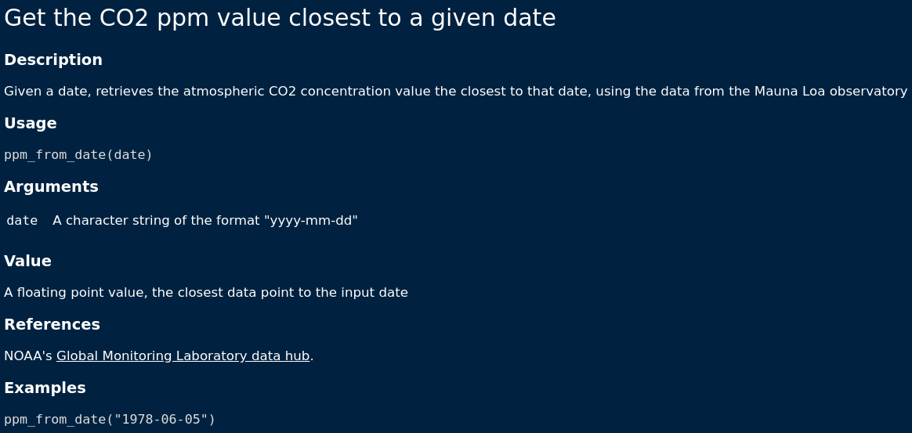

<!-- -->

```{r setup, include=FALSE}
options(htmltools.dir.version = FALSE)
knitr::opts_chunk$set(
  fig.width=9, fig.height=3.5, fig.retina=3,
  out.width = "100%",
  cache = FALSE,
  echo = TRUE,
  message = FALSE, 
  warning = FALSE,
  fig.show = TRUE,
  hiline = TRUE
)
```

```{r xaringan-themer, include=FALSE, warning=FALSE}
library(xaringanthemer)
style_mono_accent(
  base_color = "#1c5253",
  title_slide_text_color = "#1c5253",
  header_font_google = google_font("Josefin Sans"),
  text_font_google   = google_font("Montserrat", "300", "300i"),
  code_font_google   = google_font("Fira Mono"),
  title_slide_background_image = "images/title_slide_background_edited.png",
  text_font_size = "1.1em"
)
```

```{r xaringanExtra-allextras, include=FALSE, warning=FALSE, echo=FALSE}
xaringanExtra::use_tile_view()
xaringanExtra::use_share_again()
xaringanExtra::use_broadcast()
xaringanExtra::use_scribble()
xaringanExtra::use_animate_css()
xaringanExtra::use_panelset()
xaringanExtra::use_clipboard()
xaringanExtra::use_fit_screen()
xaringanExtra::use_webcam()
# xaringanExtra::use_animate_all("fade")
```

## About me


 * __RSE__ at __Concordia University__ (lab of Dr. Eric Pedersen)
 
 * __Data Scientist__ at __Environment Canada (ECCC)__ (Landscape Science Unit)
 
 * Have been coding in R for ~ 7-8 years
 
 * Maintaining 4 packages (2 on CRAN), contributed to 3 other
 
 * B.Sc. (Hons) & M.Sc. McGill University (Biology)
 
 * Website: [___vlucet.github.io___](https://vlucet.github.io/)

---
name: plan 1
## Workshop: Part 1 (now -> 10:30)

<!-- 9:30 - 9:35 : let people trickle in -->
<!-- 9:35 - 9:40 : personal introduction -->

1. __Research software in Eco-Evo__ (__~ 20 minutes__) <!-- 9:40 - 10:00 -->
  * What is research software?
  * To Package or not to Package, and alternatives to packaging
  
2. __From "spaghetti code" to "packaged" code__ (__~ 20 minutes__) <!-- 10:00 - 10:20 -->
  * Tips and tricks to modularize your research code.
  * How to write clean code.

=> __Break: 10 minutes__ <!-- 10:20 - 10:30 -->

---
name: plan 2
## Workshop: Parts 2 & 3 (10:30 -> 12:30)

3. __A package step by step with `usethis` and `devtools`__ (__~ 50 minutes__) <!-- 10:30 - 11:20 -->
  * Let's create an example package step by step.

=> (__Break: 10 minutes__) <!-- 11:20 - 11:30 -->
  
4. __Package testing, maintenance and distribution: best practices__ (__~ 50 minutes__) <!-- 11:30 - 12:20 -->
  * How to test, maintain, and distribute your package.

__Q & A__: If time allows, __~ 10 minutes__ (or on the conference app at any time) 

---
name: prereqs

## Before we get started...

For today, it is recommendeded that you are already pretty well acquainted with __R__ and __Rstudio__. But, if at least you...
  * Have written a few __functions with multiple arguments__ in R 
  * Know about "__project oriented workflow__" (for instance you use RStudio projects) 
  
...then you have the bare minimum we need for today!

Knowledge of Git/Github is also welcome as I won't have the time to explain version control software.

```r
# Run this in R while we start. 
pkgs <- c("devtools", "roxygen2", "usethis", "testthat", 
          "lubridate", "dplyr")
install.packages(pkgs)
```

---
name: refs

## On not reinventing the wheel...

There exists a __plethora of great resources on R package making__.

I have tried to __synthesize many freely available resources__.

_A full list of resources is included at the end of this workshop._

.center[
]

---
class: inverse center middle

## Research software in Eco-Evo 

---
## What is research software?

__Research software__ can be defined as any computer-based application that directly or indirectly supports users in a research task<sup>1</sup>.

For example: 
- Any software packages used to conduct research
- Any script that employ these packages
- Any code or program used to manage and process data
- Any program that runs on data collection hardware
 - Camera traps
 - Temperature sensors
 - etc.

Can include:
- Open source software
- Proprietary software (Matlab, ArcGIS, etc...)

.footnote[[1] [IGI Global](https://www.igi-global.com/dictionary/knowledge-visualization-for-research-design/69111)]

---
## Who writes research software?

__Research software__ is written by __Research software engineers__

_A Research Software Engineer (RSE) combines professional software engineering expertise with an intimate understanding of research._<sup>1</sup>

A wider definition would also include, independently of whether they have received any formal training in software engineering:
- Any __HQP__ (Highly Trained Personnel) who writes code in a research context (grad student, post-doc, etc.)
- Research assistant, lab managers, undergraduate students involved in producing code

The RSE hat is often shared and worn by different people in a lab, and increasingly researchers are required to acquire RSE skills.

.footnote[[1] [RSE Society](https://society-rse.org/about/)]

---
## RSE & code "openness"

__Software & Code literacy__, i.e. the ability to write, test and deliver reproducible code, is an essential skill to solve the reproducibility crisis in Eco-Evo.

<a href="https://journals.plos.org/plosbiology/article?id=10.1371/journal.pbio.3000763">  </a>

<a href="https://www.cell.com/trends/ecology-evolution/fulltext/S0169-5347(15)00290-6?_returnURL=https%3A%2F%2Flinkinghub.elsevier.com%2Fretrieve%2Fpii%2FS0169534715002906%3Fshowall%3Dtrue">  </a>

<a href="https://www.nature.com/articles/467753a">   </a>

---
## Open source software


_Open source software is software with source code that anyone can inspect, modify, and enhance._<sup>1</sup>

Like most research, research in eco-evo __could not take place__ without OSS (think of the R language and all the add-on packages).

Good RSE is therefore guided by OSS principles, paradigms, and tools.

.footnote[[1] [opensource.com](https://opensource.com/resources/what-open-source)]

---
## FAIR Software<sup>1</sup>

1. __Findable__
  - rich metadata + unique, persistent, identifier.

2. __Accessible__
  - metadata is both machine AND human readable.
  - deposited in trusted community approved repository.

3. __Interoperable__
  - uses community accepted standards and platforms.

4. __Reusable__
  - clear licence and documentation.
  
.footnote[[1] [library carpentry](https://librarycarpentry.org/Top-10-FAIR/2018/12/01/research-software/)]

---
## Is software a scientific contribution?

Research software is often __not recognized__ as a scientific contribution in its own right. Yet, research code:
- Represents a very significant part of a researcher's time.
- Advances our knowledge of the "how", just like research protocols.
- Should be easily citable to improve methods tractability.

Recognizing RS as a scientific contribution is not a vanity for RS developers: __code should under better scrutiny, and should be submitted to peer review__.

Who is reviewing code?
- Journals & reviewers (sometimes)
- [ROpenSci software peer review](https://ropensci.org/).
- [JOSS](https://joss.theoj.org/) and other software journals.

---
class: inverse center middle

# To Package or not to Package?

---
## Should your package exists?<sup>1</sup>

1. Will this piece of software really be useful to someone else than you (or to you in the future)? 

2. Is your idea really new, or is there already a package out there performing the exact same task?

3. If there is one, would your implementation bring something to the market, e.g. an user-friendlier implementation? (and is this improvement worth introducing a divide in user base)

4. If there is already a similar package, should you work on your own or collaborate with the author(s) of the original package?

5. As a researcher, are you ready to commit to maintaining the package (fix bugs, provide continuous support) after release/publication. (re: contributing instead)

.footnote[[1] [M. Simon's blog post](https://masalmon.eu/2017/12/11/goodrpackages/)]

---
## Private packages

_"Packaging doesn't have to be about sharing the code, it can just be to save yourself time."_<sup>1</sup>

Packages do not have to be written for someone else than yourself. Consider writing a personal package. For example, consider packaging scripts that:
- You have re-used more than once
- You have shared with students and/or collaborators
- Produces a specific analysis or figure that is often re-used within your lab

Consider starting a __lab package project__ where students are encouraged to contribute functions and document them, therefore ensuring that the coding knowledge accumulated through often tedious trial and error is curated and can serve you and your students in the future.

.footnote[[1] [H. Parker's blog post](https://hilaryparker.com/2014/04/29/writing-an-r-package-from-scratch/)]

---
## Research compendiums

I want to mention __research compendiums__ as an alternative to writing and releasing a full package.

Compendiums are actually simplified R packages (with or without documented functions) with an extra `analysis/` folder and does not require you to go through all the steps of packaging.

_The goal of a research compendium is to provide a standard and easily recognizable way for organizing the digital materials of a project to enable others to inspect, reproduce, and extend the research._<sup>1</sup> (re: OSS principles)

<a href="https://github.com/benmarwick/rrtools">   </a>

.footnote[[1] [R for Reproducible Research course](https://annakrystalli.me/rrresearch/10_compendium.html)]

---
## What should a package contain?

Two principles<sup>1</sup> :

1. Make your package compatible with the workflow of your users. 

2. Do not get too ambitious. 

I would add, consider principles of the [Unix philosophy](https://en.wikipedia.org/wiki/Unix_philosophy):

1. Small building blocks (small functions)

2. "Do One Thing and Do It Well"

.footnote[[1] [M. Simon's blog post](https://masalmon.eu/2017/12/11/goodrpackages/)]

---
## How to name your package

__Naming things is hard__. but here are a few advice<sup>1</sup> :

1. Use __lower cases__, this way your user doesn’t need to remember where the capital letters are and  full capital letter name looks like screaming.

2. Use the R package `available`, to check whether the name is valid (no special characters, etc.), whether CRAN already hosts a package with the same name and searches the web for unintended meanings of the name.

3. If your package revolves around a __central function__ or interfaces with __another program__, consider using these as the name.

.footnote[[1] [M. Simon's blog post](https://masalmon.eu/2017/12/11/goodrpackages/)]

---
class: inverse center middle

## From "spaghetti code" to "packaged" code 

---
## Messy code
<!-- Messy code is not necessarily bad code, but one could argue that it is "unfinished code", no one took the time to clean it up. Why? talk about how this part of the research process might not be valorized as much. -->

Messy code is ubiquitous in research, BUT:

.center[
__Messy code ≠ Bad code__
]

In fact, this is closer to the truth: 

.center[
__Messy code = Unfinished code__
]

Cleaning up research code should be considered an integral part of the research process. It is often the first step in any packaging endeavor.

Two aspects of code "cleanliness":

1. The way __it is organized__ (files, modules, but also spaces, number of lines, etc.)

2. The way __it reads__ (measured in "WTFs per minute"<sup>1</sup> as you read it)

.footnote[[1] [Uncle Bob's Clean Code Lectures](https://www.youtube.com/watch?v=7EmboKQH8lM)]

---
## How to write clean (R) code

<a href="https://imgs.xkcd.com/comics/good_code.png">   </a>

- Use an __IDE__ (RStudio, VSCode, etc.).

- Learn to follow a style guide, for example [the tidyverse](https://style.tidyverse.org/) or [Google's](https://google.github.io/styleguide/Rguide.html).

- Name things well (re: naming is hard). Don't be afraid to use long, informative function and variable names.

- Write __functional__ code blocks, i.e. code that employs reusable functions, each function accomplishing one thing (recall the Unix's Do One Thing Well).

- Write useful comments: do not comment everything in the code, just the parts that actually need explaining.

---
## How to write clean (R) code (ct'd)

- Use tools to identify and fix style issues in code. The packages [`lintr`](https://github.com/jimhester/lintr) and [`goodpractice`](https://github.com/MangoTheCat/goodpractice) are a good way to start.

- Engage in code review: 
 - The best way to know if your code is clean to have someone else take a look at it. 
 - Consider setting up code review sessions between students and/or collaborators. GitHub makes it easy to get started with reviewing code.

---
## Packaging your messy code

A simple recipe for packaging research scripts into a __proto-package__: 

1. Identify __modules__. Modules are pieces of codes that stands on their own and that either:
 - Achieve a specific task. 
 - Represent a discrete step in the workflow.
 
2. Establish the __expected behavior__ of each module (e.g. write tests)

2. "Refactor" modules into __functions__

3. __Rewrite__ your script to employ these functions. 

4. Repeat the process __within__ each function.

5. Consider your code _modularized_ when each function Only Does One Thing (yes, this is subjective). Sometimes, using a max number of lines per function can be useful.

---
## Object-Oriented Programming

OOP is an approach to writing code where information is organized into __objects__. 

In R, using objects will allow you to make the most of functions like `plot()` or `print()`. Pretty much everything you manipulate in R are in fact objects for which methods (versions of `plot` for example) have been written for these specific objects.

If your package requires you to organize and manipulate information with specific constraints, it might be relevant to use OOP design.

To learn more about OOP I would suggest reading:
- [Mastering Software Development in R](https://bookdown.org/rdpeng/RProgDA/object-oriented-programming.html)
- [Advanced R Book](https://adv-r.hadley.nz/oo.html)

---
class: inverse center middle

## A package step by step with {usethis} and {devtools}

---
## Get to know your R installation<sup>1</sup>

Packages live in your __library__

```{r}
R.home()
```

```{r}
list.files(R.home())
```

.footnote[[1] [forwards workshops](https://librarycarpentry.org/Top-10-FAIR/2018/12/01/research-software/)]
 
---
## A note on package states

Packages have different __states__ at different stages of development.

<a href="https://r-pkgs.org/">  </a>

---
## The 4 pillars of R package dev
<!-- Describe the 4 packages -->

1. `devtools` 
  - The R developer swiss army knife: install packages from github, check and test packages, build documentation, etc...

2. `usethis` 
  - Automates many steps in the development workflow

3. `roxygen2` 
  - The backend of devtools's documentation routine. Generates html documentation from a specific markdowm format.

4. `testthat` 
  - The backend of devtools's testing routine. Functions to help with writing test and finding errors in the code.

---
## Let's make a simple R package

We are going to code a small package called `carbon` which will retrieve the data from the Mauna Loa observatory on carbon concentration in the atmosphere.

We will package 2 functions: (1) to retrieve the data, and (2) tells you the carbon concentration around a given date.

Therefore, the process we are going to go through touches on 2 aspects of RSE:

1. Obtaining and parsing data from an online source
2. Manipulating data 

---
## Let's make a simple R package

Let's take a look at the main function:

```{r}
library(carbon)
ppm_from_date("1996-10-29")
```

---
## The `carbon` base script

Step 1: getting the data

```r
weekly_data_url <- 
  "https://gml.noaa.gov/webdata/ccgg/trends/co2/co2_weekly_mlo.txt"
co2_data <- read.table(weekly_data_url, skip = 49)

names(co2_data) <- c("year", "month", "day", "year_decimal", 
                     "co2_ppm", "nb_days", "1_year_ago", 
                     "10_years_ago", "increase_since_1980")

co2_data_clean <- co2_data |> 
  mutate(date = ymd(paste(year, month, day, sep = "-"))) |> 
  select(-year, -month, -day) |> 
  relocate(date)
```

---
## The `carbon` base script

Step 2: getting the closest ppm from a given date

```r
birthday <- ymd("1996-10-29")

ppm_from_date <- co2_data_clean |> 
  mutate(diff = abs(date - birthday)) |> 
  arrange(diff) |> 
  slice(1) |> 
  pull(co2_ppm)
```

---
## Translating code into functions

We now translate each step into a function. The function `get_weekly_data` reads in the data...

```r
get_weekly_data <- function(clean = TRUE) {
  
  weekly_data_url <- 
    "https://gml.noaa.gov/webdata/ccgg/trends/co2/co2_weekly_mlo.txt"
  
  co2_data <- read.table(weekly_data_url, skip = 49)
  names(co2_data) <- c("year", "month", "day", "year_decimal", 
                       "co2_ppm", "nb_days", "1_year_ago", 
                       "10_years_ago", "increase_since_1980")
  
  if (clean) {
    co2_data <- co2_data |> 
      dplyr::mutate(date = lubridate::ymd(paste(year, month, day, 
                                                sep = "-"))) |> 
      dplyr::select(-year, -month, -day) |> 
      dplyr::relocate(date)
  } 
  
  return(co2_data)
}
```

---
## Translating code into functions

...and `ppm_from_date` takes in a date, calls `get_weekly_data` and figures out the closest ppm from a given date.

```r
ppm_from_date <- function(date) {
  
  date_formatted <- lubridate::ymd("1996-10-29")
  
  co2_data_clean <- get_weekly_data(clean = TRUE)
  
  ppm <- co2_data_clean |> 
    dplyr::mutate(diff = abs(date - date_formatted)) |> 
    dplyr::arrange(diff) |> 
    dplyr::slice(1) |> 
    dplyr::pull(co2_ppm)
  
  return(ppm)
}
```

---
## A note about dependencies

Packages can rely on other packages (and sometimes other software) as long as those dependencies are correctly specified (we will come back to that).

For now, it is important to note that the functions we just wrote are always explicit about using other functions by using the double dot notations to access functions that are contained in other packages.

```r
dplyr::mutate
```

---
## Starting a new package with {usethis}
<!-- Show how to start a package and get the basics done -->

Open Rstudio and make sure that no projects are activated.

```r
usethis::create_package("~/carbon", open = TRUE)
```

```
✓ Creating '/home/vlucet/carbon/'
✓ Setting active project to '/home/vlucet/carbon'
✓ Creating 'R/'
✓ Writing 'DESCRIPTION'
Package: carbon
Title: What the Package Does (One Line, Title Case)
Version: 0.0.0.9000
Authors@R (parsed):
    * First Last <first.last@example.com> [aut, cre] (YOUR-ORCID-ID)
Description: What the package does (one paragraph).
License: `use_mit_license()`, `use_gpl3_license()` or friends to
    pick a license
Encoding: UTF-8
Roxygen: list(markdown = TRUE)
RoxygenNote: 7.1.1
```

---
## The Package anatomy
<!-- The anatomy of a package -->

Let's take a look at the pacakge anatomy...

.center[

]

---
## Editing the DESCRIPTION file

```r
Package: carbon
Title: Get the CO2 ppm Value Closest to a Given Date
Version: 0.0.0.9000
Authors@R: 
    person(given = "Valentin",
           family = "Lucey",
           role = c("aut", "cre"),
           email = "valentin.lucet@gmail.com")
Description: Retrieves weekly CO2 ppm from the Mauna Loa 
    observatory data hub, and provides a simple function that 
    retrieves the ppm value closest to a given date.
Encoding: UTF-8
Roxygen: list(markdown = TRUE)
RoxygenNote: 7.1.1
```

---
## Adding dependencies

All dependency packages that we accessed earlier with `::` need to be added to the DESCRIPTION file:

```r
usethis::use_package("lubridate")
usethis::use_package("dplyr")
```

Which adds a new section to DESCRIPTION:

```r
Imports: 
    lubridate,
    dplyr
```

---
## Adding code

It is good practice to organize code in __R/__ under different files. 

Usually each file is a different function or set of functions that work together. For simplicity's sake, let's put our functions in different files.

We can use `use_r` to create code files.

```r
usethis::use_r("get_weekly_data")

usethis::use_r("ppm_from_date")
```

---
## Exporting functions

Once packaged, not all functions might be available to the user. This is by design: you might want to write helper functions and sub routines that your users have no use for. You need to explicitly decide which functions to "export" for the user. 

To do so we need to add an "export tag" to the function file. We are using the `roxygen` documentation framework, which means our function file must look like that:

```r
#' @export
ppm_from_date <- function(date) {

  ...
  
}
```

---
## Exporting functions

We now need to run `roxygen` to confirm the function export.

```r
devtools::document
```

This will edit the package NAMESPACE file which now looks like:

```
# Generated by roxygen2: do not edit by hand

export(ppm_from_date)
```

The function `ppm_from_date` is now set up for exportation.

---
## Documenting functions

```
#' Get the CO2 ppm value closest to a given date
#'
#' Given a date, retrieves the atmospheric CO2 concentration value the closest
#' to that date, using the data from the Mauna Loa observatory
#'
#' @param date A character string of the format "yyyy-mm-dd"
#'
#' @return
#' A floating point value, the closest data point to the input date
#'
#' @references
#' NOAA's [Global Monitoring Laboratory data hub](https://gml.noaa.gov/ccgg/trends/data.html).
#'
#' @examples
#' ppm_from_date("1978-06-05")
#'
#' @export
ppm_from_date <- function(date) {
```

---
## Documenting functions

```r
devtools::document()
?ppm_from_date
```

.center[

]

---
## The documentation workflow

<a href="https://forwards.github.io/workshops/package-dev-modules/">  </a>

---
## Trying out functions

While you develop the package, it is important to know about `devtools::load_all`. This will make ALL functions in the package available to you to test things interactively.

You can also try out non-exported functions that way:

```r
devtools::load_all()
get_weekly_data(clean = FALSE)
```

---
## The development workflow

<a href="https://forwards.github.io/workshops/package-dev-modules/">  </a>

---
## Building and installing

We are now ready to build and install the package. You can either:

- Run `devtools::install()`
- Use `CTRL+SHIFT+B` (or on mac `CMD+SHIFT+B`)

---
## Choosing a license

To choose a license, let's head to [choosealicense.com](https://choosealicense.com/).

We are going to go with GPL-3.

```r
usethis::use_gpl3_license()
```

```
✓ Setting active project to '/home/vlucet/carbon'
✓ Setting License field in DESCRIPTION to 'GPL (>= 3)'
✓ Writing 'LICENSE.md'
✓ Adding '^LICENSE\\.md$' to '.Rbuildignore'
```

---
## Adding a readme

```r
usethis::use_readme_rmd()
```

- Adds a readme.
- Creates commit hook so that changes to readme cant be commited before its re-knitted.

```
✓ Writing 'README.Rmd'
✓ Adding '^README\\.Rmd$' to '.Rbuildignore'
• Modify 'README.Rmd'
```

---
## Checking your package

R has a built-in system for checking that packages are properly written. You can run it with 

```r
devtools::check()
```

The results of the check:

```r
── R CMD check results ──────────────── carbon 0.0.0.9000 ────
Duration: 8.4s

> checking R code for possible problems ... NOTE
  get_weekly_data: no visible global function definition for ‘read.table’
  get_weekly_data: no visible binding for global variable ‘year’
  get_weekly_data: no visible binding for global variable ‘month’
  get_weekly_data: no visible binding for global variable ‘day’
  ppm_from_date: no visible binding for global variable ‘co2_ppm’
  Undefined global functions or variables:
    co2_ppm day month read.table year
  Consider adding
    importFrom("utils", "read.table")
  to your NAMESPACE file.
```

---
##  The development workflow

In summary:

1. Modify code => `load_all()` => try out code

2. Modify documentation => `document()` => `install` => very doc

4. `install` + `check()`

5. Repeat!

---
class: inverse center middle

## Package testing, maintenance and distribution: best practices
<!-- Include licensing in there -->

---
## Using GitHub

---
## Testing: the basics

---
## Test-Driven Development

---
## Test coverage

---
## Github Badges

Here's an example of adding a license badge:


```r
usethis::use_badge(
  badge_name = "License: GPL v3", 
  src = "https://img.shields.io/badge/License-GPL%20v3-blue.svg", 
  href = "http://www.gnu.org/licenses/gpl-3.0"
)
```
---
## Vignettes

---
## Continuous integration

---
## GitHub actions

---
## A website for your package

---
## Distributing your package

---
## Submitting to CRAN or BIOCONDUCTOR

---
## Hosting on r-universe

---
## Submitting to ROpenSci

---
## Publishing in a journal

---
class: center, middle

# Thanks!

Slides created via the R packages:

[**xaringan**](https://github.com/yihui/xaringan)<br>
[gadenbuie/xaringanthemer](https://github.com/gadenbuie/xaringanthemer)

---
name: sources

# Sources

* Hadley Wickham's [R packages](https://r-pkgs.org/)
* Maelle Simon's [How to develop good R packages (for open science)](https://masalmon.eu/2017/12/11/goodrpackages/)
* [Forwards Workshops](https://forwards.github.io/workshops/), [#1](https://forwards.github.io/workshops/package-dev-modules/slides/01-packages-in-a-nutshell/packages-in-a-nutshell.html#1), [#2](https://forwards.github.io/workshops/package-dev-modules/slides/02-setting-up-system/setting-up-system.html#1) and [#3](https://forwards.github.io/workshops/package-dev-modules/slides/03-your-first-package/your-first-package.html#1)
* Hilary Parker's [Writing an R Package from Scratch](https://hilaryparker.com/2014/04/29/writing-an-r-package-from-scratch/)
* [rrtools](https://github.com/benmarwick/rrtools) and [accompanying book](https://annakrystalli.me/rrresearch/10_compendium.html) & [research compendium reference](https://research-compendium.science/)
* [Writing clean code in R blog post](https://www.r-bloggers.com/2019/03/writing-clean-and-readable-r-code-the-easy-way/)
* [Uncle Bob's Clean Code Lectures](https://www.youtube.com/watch?v=7EmboKQH8lM)
* [IGI Global](https://www.igi-global.com/dictionary/knowledge-visualization-for-research-design/69111)
* [RSE Society](https://society-rse.org/about/)
* [opensource.com](https://opensource.com/resources/what-open-source)
* [library carpentry](https://librarycarpentry.org/Top-10-FAIR/2018/12/01/research-software/)
* [Mastering Software Development in R](https://bookdown.org/rdpeng/RProgDA/object-oriented-programming.html)
* [Advanced R Book](https://adv-r.hadley.nz/oo.html)


<!-- Retired slides

---
## OOP in R

The 3 most popular types of OOP frameworks in R<sup>1</sup> :

1. __S3__ is R’s first OOP system, and is a rather informal implementation, relying on relies on conventions rather than "ironclad guarantees". __Easiest to start with, low cost way to solve many simple problems__.

2. __S4__ is a formal and rigorous rewrite of S3, with more guarantees and greater encapsulation.

3. __R6__ is provided by a package and implements __mutable__ S4 objects.

Which one to choose? Many trade-offs exists. 

In a nutshell: __choose S3 for simplicity, S4 for rigor and R6 if you need mutability__.

.footnote[[1] [Advanced R Book](https://adv-r.hadley.nz/oo.html)]


---
## Startup files

__.Rprofile__
- Code that runs at startup
 - Load packages, set options, use with moderation!

__.Renviron__
- Settings for R
 - Set library paths and environment variables

-->