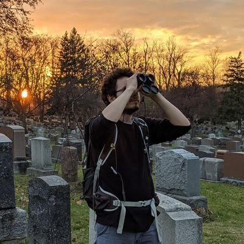

<!-- -->

```{r setup, include=FALSE}
options(htmltools.dir.version = FALSE)
knitr::opts_chunk$set(
  fig.width=9, fig.height=3.5, fig.retina=3,
  out.width = "100%",
  cache = FALSE,
  echo = TRUE,
  message = FALSE, 
  warning = FALSE,
  fig.show = TRUE,
  hiline = TRUE
)
```

```{r xaringan-themer, include=FALSE, warning=FALSE}
library(xaringanthemer)
style_mono_accent(
  base_color = "#1c5253",
  title_slide_text_color = "#1c5253",
  header_font_google = google_font("Josefin Sans"),
  text_font_google   = google_font("Montserrat", "300", "300i"),
  code_font_google   = google_font("Fira Mono"),
  title_slide_background_image = "images/title_slide_background.jpeg",
  text_font_size = "1.1em"
)
```

```{r xaringanExtra-allextras, include=FALSE, warning=FALSE, echo=FALSE}
xaringanExtra::use_tile_view()
xaringanExtra::use_share_again()
xaringanExtra::use_broadcast()
xaringanExtra::use_scribble()
xaringanExtra::use_animate_css()
xaringanExtra::use_panelset()
xaringanExtra::use_clipboard()
xaringanExtra::use_fit_screen()
xaringanExtra::use_webcam()
# xaringanExtra::use_animate_all("fade")
```

## About me



 * __RSE__ at __Concordia University__ (lab of Dr. Eric Pedersen)
 
 * __Data Scientist__ at __Environment Canada (ECCC)__ (Landscape Science Unit)
 
 * Have been coding in R for ~ 7-8 years
 
 * Maintaining 4 packages (2 on CRAN), contributed to 3 other
 
 * B.Sc. (Hons) & M.Sc. McGill University (Biology)
 
 * Website: [___vlucet.github.io___](https://vlucet.github.io/)

---
name: plan 1
## Workshop: Part 1 (now -> 10:30)

<!-- 9:30 - 9:35 : let people trickle in -->
<!-- 9:35 - 9:40 : personal introduction -->

1. __Research software in Eco-Evo__ (__~ 10 minutes__) <!-- 9:40 - 9:50 -->
  * What is research software?
  * To Package or not to Package: what are the alternatives?
    
2. __Design patterns: the "tooling" vs "workflow" paradigms__ (__~ 10 minutes__) <!-- 9:50 - 10:00 -->
  * General vs workflow oriented packaging.
  * Object-oriented designs and functional programming.
  
3. __From "spaghetti code" to "packaged" code__ (__~ 20 minutes__) <!-- 10:00 - 10:20 -->
  * Tips and tricks to modularize your research code.
  * How to write clean code.
  
(_Break: 10 minutes_) <!-- 10:20 - 10:30 -->

---
name: plan 2
## Workshop: Parts 2 & 3 (10:30 -> 12:30)

4. __Your personal assistants: `usethis` and `devtools`__ (__~ 50 minutes__) <!-- 10:30 - 11:20 -->
  * Let's create an example package step by step.
  * (__Break: 10 minutes__) <!-- 11:20 - 11:30 -->
5. __Package testing, maintenance and distribution: best practices__ (__~ 50 minutes__) <!-- 11:30 - 12:20 -->
  * How to test, maintain, and distribute your package.

__Q & A__: __~ 10 minutes__ (or on the conference app at any time) 


---
name: prereqs

# Before we get started...

For today, it is recommended that you are already pretty well acquainted with __R__ and __Rstudio__. But, if at least you...
  * Have written a few __functions with multiple arguments__ in R 
  * Know about "__project oriented workflow__" (for instance you use RStudio projects) 
  
...then you have the bare minimum we need for today!

Knowledge of Git/Github is also welcome as I won't have the time to explain version control software.

```{r, eval = FALSE}
# Run this in R before we start. 
pkgs <- c("devtools", "roxygen2", "usethis")
install.packages(pkgs)
```

_Note: the first part of the workshop is relevant to users of any level._

---
name: refs

# On not reinventing the wheel...

There exists a __plethora of great resources on R package making__, resources from which I have learned myself. 

This workshop has been devised by attempting to __synthesize many freely available resources__ put together by a whole bunch of excellent people. 

_A full list of resources is included at the end of this workshop._

.center[

]

---
class: inverse center middle

# Research software in Eco-Evo 

---
# What is research software?
<!-- All the programs that support research, from the code written to program a microscope, to the movement detection programs in camera traps, all code to generate analyses but also all code used to generate figures -->

---
# Who writes research software?
<!-- Engineers, yes, but mostly scientists: they are all RSEs. Speak about how these skills are in higher demand and we dont necessarily have the skills to maintain code etc... -->

---
# Open source vs proprietary software
<!-- Introduce OSS, use the xkcd "jenga" tower comic -->

---
# Is software a scientific contribution?
<!-- YES! Should be recognized as one. JOSS, ROpenSci, maybe cite the talk by Richard McElreath -->

---
# What forms does research software take?
<!-- Packages, yes BUT also research compendiums, code that is shared as scripts, zipped archive, etc... in increasing order of generated entropy... -->

---
# To Package or not to Package?
<!-- Reuse Maelle Simon's work (make sure to cite properly): Should your package even exist?. Include comment on lab/personnal package -->

---
# To Package or not to Package? (cont'd)
<!-- Discuss the effort at different stages of research. -->

---
# What should a package contain?
<!-- re M.S. blogpost -->

--- 
# How to name your package
<!-- Naming is hard ! small cases, check with {available} -->

---
class: inverse center middle

# Design patterns: "tooling" vs "workflow"

---
# Reasons to make a package fall into 2 broad categories
<!-- One is to provide a general tool, the other to make a certain workflow replicable and adaptable. This is on a continuum from generality to specificity. In the end, two faces of the same coin -->

---
# "tooling" packages
<!-- Characteristics: general, no object structure (or very light). One function does one thing. Lab package, personal package -->

---
# "workflow" packages 
<!-- Makes a specific research workflow available, can have a strong object structure (but beware!). In the back, may be built with simpler "tooling" elements -->

---
# A research package decision chart
<!-- Make a decision chart that sums up all we talked about and if we have time ask if there are any questions -->

---
class: inverse center middle

# From "spaghetti code" to "packaged" code 

---
# Messy code is ubiquitous in research
<!-- Messy code is not necessarily bad code, but one could argue that it is "unfinished code", no one took the time to clean it up. Why? talk about how this part of the research process might not be valorized as much. -->

---
# How to write clean code (in general)
<!-- Style guide, clear names, small functions, useful comments, see the clean code lectures on youtube maybe -->

---
# Packaging messy research code
<!-- [mention that these principles are even better to implement as one *writes* the code] identify steps (for workflow) or manipulations and "re-factor" the code into functions, => then work on modularizing the code, i.e. placing functions in different scripts that can be sourced. etc... -->

---
# Packaging messy research code (cont'd)
<!-- continue the discussion => think about object oriented design, write a class diagram maybe, and think about attributes that need to be kept track of -->

---
# OOP in R
<!-- use hadley's book in thi section to write an intro to the different OOP systems in R -->

---
class: inverse center middle

# A package step by step with {usethis} and {devtools}

---
class: inverse center middle

# Package testing, maintenance and distribution: best practices

---
class: center, middle

# Thanks!

Slides created via the R packages:

[**xaringan**](https://github.com/yihui/xaringan)<br>
[gadenbuie/xaringanthemer](https://github.com/gadenbuie/xaringanthemer)

---
name: sources

# Sources

* Maelle Simon's [How to develop good R packages (for open science)](https://masalmon.eu/2017/12/11/goodrpackages/)
